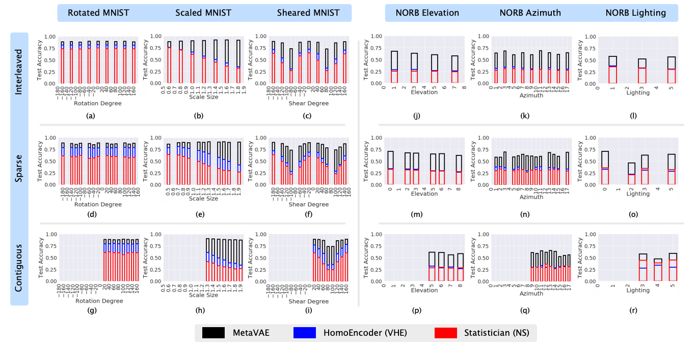
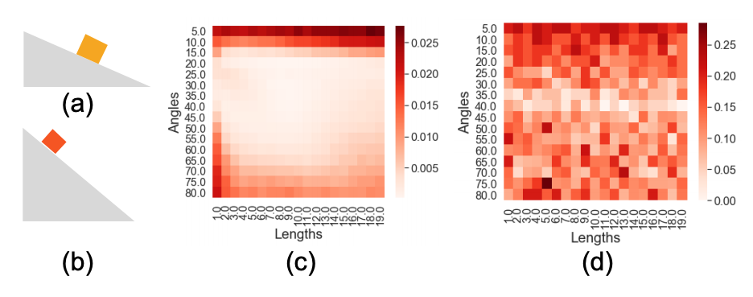
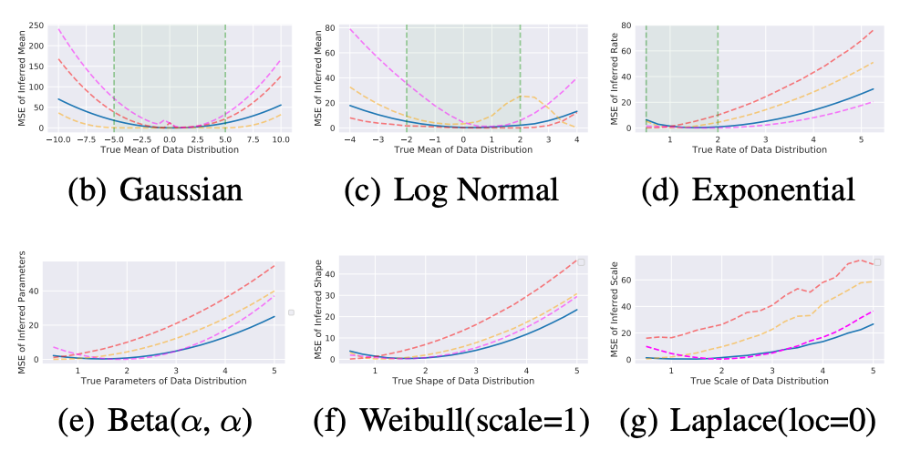

# Meta-Amortized Variational Inference
A PyTorch implementation of "Meta-Amortized Variational Inference and Learning" (https://arxiv.org/abs/1902.01950)

## Abstract
Despite the recent success in probabilistic modeling and their applications, generative models trained using traditional inference techniques struggle to adapt to new distributions, even when the target distribution may be closely related to the ones seen during training. In this work, we present a doubly-amortized variational inference procedure as a way to address this challenge. By sharing computation across not only a set of query inputs, but also a set of different, related probabilistic models, we learn transferable latent representations that generalize across several related distributions. In particular, given a set of distributions over images, we find the learned representations to transfer to different data transformations. We empirically demonstrate the effectiveness of our method by introducing the MetaVAE, and show that it significantly outperforms baselines on downstream image classification tasks on MNIST (10-50%) and NORB (10-35%).

## Setup Instructions
Tested with Python 3 and PyTorch 1.0. Install a conda environment and install the necessary libraries.
```
conda create -n metavae python=3 anaconda
conda activate metavae
conda install pytorch torchvision -c pytorch
pip install tqdm, dotmap, sklearn
```
This repository is organized as a package. For every fresh terminal, you should source the path.
```
source init_env.sh
```
Download the NORB dataset from https://cs.nyu.edu/~yann/research/norb/. We have a preprocessing script to save NORB images as numpy files. Note that the file contains a `NUMPY_ROOT` variable you should change to your own directory.
```
cd scripts/utils
python preprocess_norb.py
```

## Experiment Instructions

We have three sets of experiments as shown in the main text. Below we provide instructions for running each of them.

### Transformation Invariance Experiments



In `scripts/configs`, we have configuration files for all the experiments used to make Figure 6. To run an experiment testing transformation invariance, try the following:
```
python scripts/run.py ./config/mnist/rotate/meta.json
```

Among the config files are other baseline models such as Neural Statistician and Variational Homoencoder. 

After learning a representation, to quantify how good it is, we consider the transfer task of predicting the MNIST digit or NORB class using a linear model on the representations alone. To run these, we include config files named `predictor_*.json`. For instance
```
python scripts/run.py ./config/mnist/rotte/predictor_meta.json
```

Note that you will need to edit these config files to support your file and directory paths.

### Compiled Inference Experiments



To run the physics compiled inference experiments, do
```
python scripts/physics/meta.py 
```
or to run the VAE baseline, do
```
python scripts/physics/base.py 
```
Each of these will produce a numpy matrix representing the error that can be visualized as a heatmap as shown in Figure 1.


### Exponential Family Experiments



For the exponential family experiments, we include two scripts: one for learning sufficient statistics for a single family (Gaussian only), and one for learning statistics across several families. 
```
python scripts/expfam/train_one.py -h
```
Note that these scripts contain lots of command line arguments. 